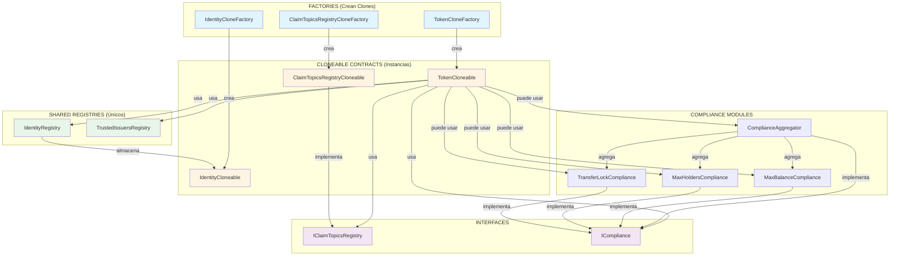

# 📊 Gráfico de Dependencias de Contratos

## 🎯 Vista General del Sistema



## 🔍 Dependencias Detalladas por Contrato

### 1. TokenCloneable.sol

**Importa:**
```
├── @openzeppelin/contracts-upgradeable
│   ├── ERC20Upgradeable
│   ├── AccessControlUpgradeable
│   └── PausableUpgradeable
│
├── ./IdentityRegistry.sol
├── ./TrustedIssuersRegistry.sol
├── ./IClaimTopicsRegistry.sol (interface)
├── ./ICompliance.sol (interface)
└── ./compliance/ComplianceAggregator.sol
```

**Usa en runtime:**
- `IdentityRegistry` → para verificar identidades
- `TrustedIssuersRegistry` → para verificar emisores
- `IClaimTopicsRegistry` → para obtener requisitos de claims
- `ICompliance[]` → array de módulos de compliance

**Diagrama de flujo:**
```
TokenCloneable
    │
    ├─► IdentityRegistry.isRegistered(wallet)
    ├─► IdentityRegistry.getIdentity(wallet)
    │       └─► retorna → IdentityCloneable address
    │
    ├─► IClaimTopicsRegistry.getClaimTopics()
    │       └─► retorna → uint256[] topics requeridos
    │
    ├─► TrustedIssuersRegistry.getTrustedIssuers()
    │       └─► retorna → address[] issuers confiables
    │
    └─► ICompliance[].canTransfer(from, to, amount)
            └─► cada módulo verifica sus reglas
```

### 2. IdentityCloneable.sol

**Importa:**
```
└── @openzeppelin/contracts-upgradeable
    ├── OwnableUpgradeable
    └── IClaimTopicsRegistry.sol (interface)
```

**NO depende de otros contratos del sistema**
- Es autónomo
- Solo almacena claims
- El owner gestiona los claims

**Estructura:**
```
IdentityCloneable
    ├── Claims Storage
    │   └── mapping(topic => mapping(issuer => Claim))
    │
    └── Métodos
        ├── addClaim()
        ├── removeClaim()
        ├── getClaim()
        └── claimExists()
```

### 3. ClaimTopicsRegistryCloneable.sol

**Importa:**
```
├── @openzeppelin/contracts-upgradeable
│   └── OwnableUpgradeable
│
└── ./IClaimTopicsRegistry.sol (implementa interface)
```

**NO depende de otros contratos del sistema**
- Es autónomo
- Solo almacena array de topics
- Se consulta desde Token

**Estructura:**
```
ClaimTopicsRegistryCloneable
    ├── Topics Storage
    │   └── uint256[] claimTopics
    │
    └── Métodos
        ├── addClaimTopic()
        ├── removeClaimTopic()
        ├── getClaimTopics()
        └── claimTopicExists()
```

### 4. IdentityRegistry.sol

**Importa:**
```
├── @openzeppelin/contracts
│   └── Ownable
│
└── ./IdentityCloneable.sol
```

**Usa:**
- `IdentityCloneable` → almacena referencias a identities

**Estructura:**
```
IdentityRegistry
    ├── Mappings
    │   ├── address => IdentityCloneable (identities)
    │   ├── address => bool (registered)
    │   └── address[] (registeredAddresses)
    │
    └── Métodos
        ├── registerIdentity(wallet, identity)
        ├── updateIdentity(wallet, identity)
        ├── removeIdentity(wallet)
        ├── getIdentity(wallet)
        └── isRegistered(wallet)
```

### 5. TrustedIssuersRegistry.sol

**Importa:**
```
└── @openzeppelin/contracts
    └── Ownable
```

**NO depende de otros contratos del sistema**
- Es autónomo
- Gestiona lista de emisores confiables
- Define qué topics puede emitir cada issuer

**Estructura:**
```
TrustedIssuersRegistry
    ├── Mappings
    │   ├── address[] trustedIssuers
    │   ├── mapping(address => bool) isTrusted
    │   └── mapping(address => uint256[]) issuerClaimTopics
    │
    └── Métodos
        ├── addTrustedIssuer(issuer, topics[])
        ├── removeTrustedIssuer(issuer)
        ├── getTrustedIssuers()
        └── hasClaimTopic(issuer, topic)
```

### 6. Compliance Modules

**Todos implementan:**
```
ICompliance interface
    ├── canTransfer(from, to, amount) → bool
    ├── transferred(from, to, amount)
    ├── created(to, amount)
    └── destroyed(from, amount)
```

#### MaxBalanceCompliance
```
MaxBalanceCompliance
    ├── Imports: ICompliance, Ownable
    ├── Storage: maxBalance, tokenContract
    └── Verifica: balance[to] + amount <= maxBalance
```

#### MaxHoldersCompliance
```
MaxHoldersCompliance
    ├── Imports: ICompliance, Ownable
    ├── Storage: maxHolders, holderCount, tokenContract
    └── Verifica: holderCount < maxHolders
```

#### TransferLockCompliance
```
TransferLockCompliance
    ├── Imports: ICompliance, Ownable
    ├── Storage: lockPeriod, lastReceived[], tokenContract
    └── Verifica: block.timestamp > lastReceived[from] + lockPeriod
```

#### ComplianceAggregator
```
ComplianceAggregator
    ├── Imports: ICompliance, Ownable
    ├── Storage: mapping(token => ICompliance[]) modules
    └── Funciona como proxy que consulta múltiples módulos
```

### 7. Factories

#### TokenCloneFactory
```
TokenCloneFactory
    ├── Imports: Clones, Ownable, TokenCloneable
    ├── Storage: 
    │   ├── implementation (immutable)
    │   ├── adminTokens[]
    │   └── allTokens[]
    └── Crea: TokenCloneable clones
```

#### IdentityCloneFactory
```
IdentityCloneFactory
    ├── Imports: Clones, Ownable, IdentityCloneable
    ├── Storage:
    │   ├── implementation (immutable)
    │   ├── userIdentities[]
    │   └── allIdentities[]
    └── Crea: IdentityCloneable clones
```

#### ClaimTopicsRegistryCloneFactory
```
ClaimTopicsRegistryCloneFactory
    ├── Imports: Clones, Ownable, ClaimTopicsRegistryCloneable
    ├── Storage:
    │   ├── implementation (immutable)
    │   ├── ownerRegistries[]
    │   ├── allRegistries[]
    │   └── tokenRegistry (token => registry)
    └── Crea: ClaimTopicsRegistryCloneable clones
```

## 🔄 Flujo de Interacción Completo

### Escenario: Transfer de Tokens

```
User: token.transfer(recipient, amount)
    │
    ▼
TokenCloneable._update(sender, recipient, amount)
    │
    ├─► canTransfer(sender, recipient, amount)?
    │   │
    │   ├─► paused()? → NO
    │   │
    │   ├─► isFrozen(sender) || isFrozen(recipient)? → NO
    │   │
    │   ├─► isVerified(sender)?
    │   │   ├─► IdentityRegistry.isRegistered(sender)? → YES
    │   │   ├─► IdentityRegistry.getIdentity(sender) → identityAddress
    │   │   ├─► IClaimTopicsRegistry.getClaimTopics() → [1,2,3]
    │   │   ├─► Para cada topic:
    │   │   │   ├─► TrustedIssuersRegistry.getTrustedIssuers()
    │   │   │   └─► identityAddress.claimExists(topic, issuer)? → YES
    │   │   └─► VERIFIED ✓
    │   │
    │   ├─► isVerified(recipient)?
    │   │   └─► [mismo proceso] → VERIFIED ✓
    │   │
    │   └─► Para cada compliance module:
    │       ├─► MaxBalanceCompliance.canTransfer()? → YES
    │       ├─► MaxHoldersCompliance.canTransfer()? → YES
    │       └─► TransferLockCompliance.canTransfer()? → YES
    │
    ├─► super._update() → ejecuta ERC20 transfer
    │
    └─► notificar compliance modules:
        ├─► MaxBalanceCompliance.transferred()
        ├─► MaxHoldersCompliance.transferred()
        └─► TransferLockCompliance.transferred()
```

## 📦 Niveles de Dependencia

```
NIVEL 0 (Sin dependencias internas):
├── IdentityCloneable
├── ClaimTopicsRegistryCloneable
├── TrustedIssuersRegistry
└── Compliance Modules (MaxBalance, MaxHolders, TransferLock)

NIVEL 1 (Depende de Nivel 0):
├── IdentityRegistry (usa IdentityCloneable)
└── ComplianceAggregator (usa ICompliance)

NIVEL 2 (Depende de Nivel 0 y 1):
└── TokenCloneable (usa todo)

NIVEL 3 (Crea contratos de otros niveles):
├── TokenCloneFactory
├── IdentityCloneFactory
└── ClaimTopicsRegistryCloneFactory
```

## 🎨 Diagrama de Capas

```
┌─────────────────────────────────────────────────────────────┐
│                    CAPA 3: FACTORIES                        │
│  TokenCloneFactory | IdentityCloneFactory | ClaimTopics... │
└────────────────────────┬────────────────────────────────────┘
                         │ crea
┌────────────────────────▼────────────────────────────────────┐
│                CAPA 2: BUSINESS LOGIC                       │
│                    TokenCloneable                           │
└──┬─────────────────┬─────────────────┬──────────────────────┘
   │ usa             │ usa             │ usa
┌──▼─────────────────▼─────────────────▼──────────────────────┐
│             CAPA 1: REGISTRIES & MODULES                    │
│  IdentityRegistry | TrustedIssuersRegistry | Compliance... │
└──┬─────────────────┬─────────────────┬──────────────────────┘
   │ almacena        │                 │ implementa
┌──▼─────────────────▼─────────────────▼──────────────────────┐
│            CAPA 0: CORE CONTRACTS                           │
│  IdentityCloneable | ClaimTopicsRegistryCloneable |        │
│  ICompliance | IClaimTopicsRegistry (interfaces)           │
└─────────────────────────────────────────────────────────────┘
```

## 🔗 Matriz de Dependencias

| Contrato | IdentityReg | TrustedIssuers | ClaimTopics | Identity | Compliance |
|----------|-------------|----------------|-------------|----------|------------|
| **TokenCloneable** | ✅ | ✅ | ✅ | ❌ | ✅ |
| **IdentityCloneable** | ❌ | ❌ | ❌ | ❌ | ❌ |
| **ClaimTopicsReg** | ❌ | ❌ | ❌ | ❌ | ❌ |
| **IdentityRegistry** | ❌ | ❌ | ❌ | ✅ | ❌ |
| **TrustedIssuers** | ❌ | ❌ | ❌ | ❌ | ❌ |
| **ComplianceModules** | ❌ | ❌ | ❌ | ❌ | ❌ |

**Leyenda:**
- ✅ = Depende directamente
- ❌ = No depende

## 💡 Principios de Diseño

1. **Bajo Acoplamiento**: 
   - Los contratos core (Identity, ClaimTopics) no dependen de nada
   - Solo Token orquesta todas las piezas

2. **Alta Cohesión**:
   - Cada contrato tiene una responsabilidad clara
   - Interfaces permiten intercambiar implementaciones

3. **Inversión de Dependencias**:
   - Token depende de interfaces (IClaimTopicsRegistry, ICompliance)
   - No de implementaciones concretas

4. **Separación de Concerns**:
   - Identity: almacena claims
   - Registry: vincula wallets
   - Token: orquesta verificación
   - Compliance: reglas de negocio

Esta arquitectura permite:
- ✅ Testing independiente de cada capa
- ✅ Reemplazo de componentes sin afectar otros
- ✅ Extensibilidad (nuevos compliance modules)
- ✅ Reutilización (mismos registries para múltiples tokens)

